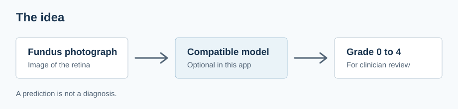
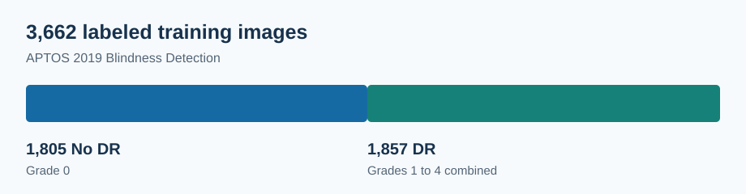

# DR Vision

DR Vision is a Django app for managing patients and appointments and exploring retinal image analysis. The patient and appointment features work without an AI model.

## Project story

Diabetic retinopathy (DR) is an eye condition caused by diabetes. It may have no early symptoms, so regular eye examinations matter. The goal of this project is to explore whether a machine learning model can help classify DR from a photograph of the retina into five stages. It is a learning project, not a replacement for an eye examination or clinical diagnosis. Read more from the [National Eye Institute](https://www.nei.nih.gov/eye-health-information/eye-conditions-and-diseases/diabetic-retinopathy).



The [APTOS 2019 Blindness Detection dataset](https://www.kaggle.com/c/aptos2019-blindness-detection) contains 3,662 labeled training photographs of retinas. The images vary in size and were taken under different conditions. A clinician assigned each training image one grade:

| Grade | Meaning |
| --- | --- |
| 0 | No DR |
| 1 | Mild |
| 2 | Moderate |
| 3 | Severe |
| 4 | Proliferative DR |

Of the 3,662 images, 1,805 are labeled No DR and 1,857 are labeled with a DR grade.



The notebooks in `research/notebooks/` explore CNN and transfer-learning approaches using this dataset. They do not document the training of the model checkpoint used by the app. The dataset images are not included in this repository.

## Run the app

Use Python 3.12. From the project directory, run:

```bash
python3 -m venv .venv
source .venv/bin/activate
python -m pip install -r requirements.txt
python manage.py migrate
python manage.py runserver
```

Open <http://127.0.0.1:8000/register/> to create an account and sign in. On the dashboard, add patients, review their records, and schedule appointments.

For fictional patients and appointments to explore, run `python manage.py seed_demo`. The command prints the password for a separate `demo_clinic` account.

## Get `best_model.pth` for image analysis

The model file is **not part of the Kaggle dataset** and is not included in Git. This workspace has a local copy at `app/model_weights/best_model.pth`, but someone cloning the repository needs to obtain the trained file separately from the project owner. A different `.pth` file may not work: it must match the `DRNet` model defined in `app/utils.py`.

Once you have a compatible checkpoint, place it at `app/model_weights/best_model.pth` and install the optional packages:

```bash
python -m pip install torch torchvision --index-url https://download.pytorch.org/whl/cpu
python -m pip install opencv-python-headless
```

Restart the app, sign in, add a patient, and open **Upload Image** to select a retinal photograph. The result shows a predicted grade for review. Without the model file, you can still use patients and appointments.
